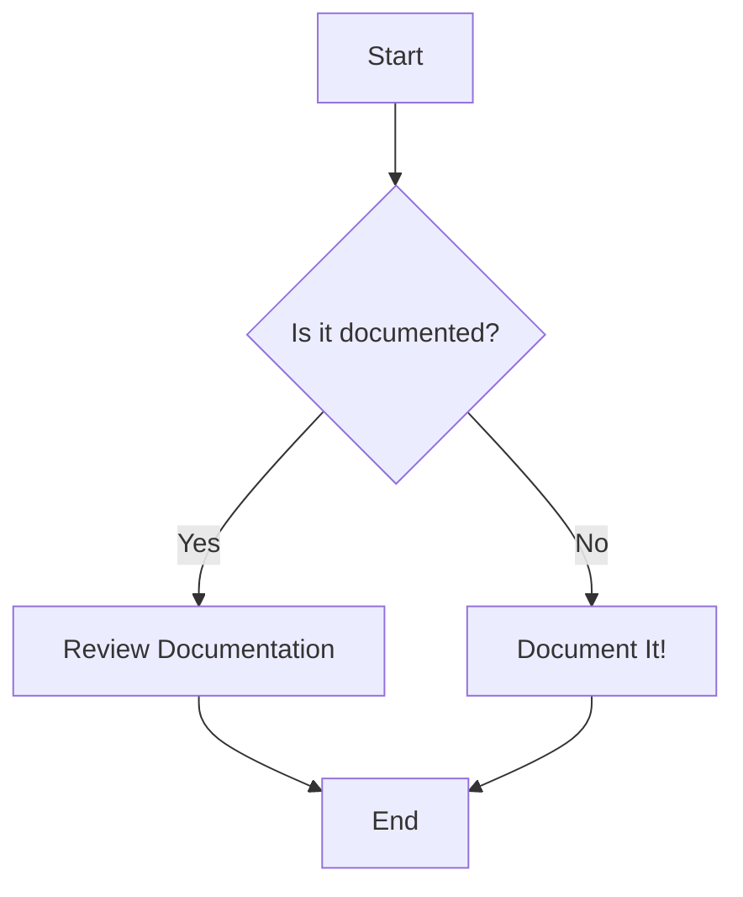

# Gemini Standards

This document outlines the standards and practices to be followed by the Gemini AI assistant.

# Gemini Agent Utilization Rule

When responding to a prompt, first check the `/.gemini/gemini-agents` directory to see if there is a relevant agent that can be used to construct a better response. The agent definitions are in markdown files, with the name and description of the agent in the frontmatter. If a relevant agent is found, use the content of the file as a system prompt to construct the response.

You can also utilize pre-configured teams of agents located in the `/.gemini/gemini-agents/teams` directory. To use a team, reference its filename in your prompt (e.g., "Using the web-dev-team, ...").

## Mermaid Diagrams

When documenting database schemas, workflows, or other visual concepts, use Mermaid diagrams to create clear and maintainable visualizations.

### Example

