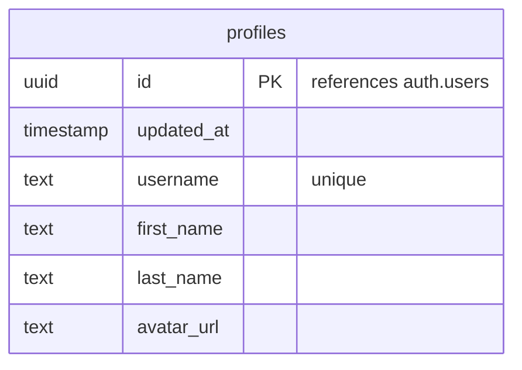

# Database Schema

This document outlines the database schema for the project.

## Tables

### `profiles`

This table stores public user profile data.



**Columns**

*   `id`: A UUID that references the `id` in the `auth.users` table. This is the primary key.
*   `updated_at`: A timestamp that is updated when the profile is changed.
*   `username`: The user's unique username. Must be at least 3 characters long.
*   `first_name`: The user's first name.
*   `last_name`: The user's last name.
*   `avatar_url`: A URL to the user's avatar image.

**Row Level Security (RLS)**

*   Profiles are publicly viewable.
*   Users can only insert their own profile.
*   Users can only update their own profile.

## Functions

### `handle_new_user()`

This function is a trigger that fires after a new user is inserted into the `auth.users` table. It creates a corresponding profile for the new user in the `public.profiles` table.

```mermaid
graph TD
    A[New user signs up] --> B{auth.users INSERT};
    B --> C{Trigger on_auth_user_created};
    C --> D[handle_new_user() function];
    D --> E{INSERT into public.profiles};
```

## Storage

### `avatars` Bucket

This storage bucket is used to store user avatar images.

**RLS Policies**

*   Avatar images are publicly accessible.
*   Anyone can upload an avatar.
*   Anyone can update their own avatar.
