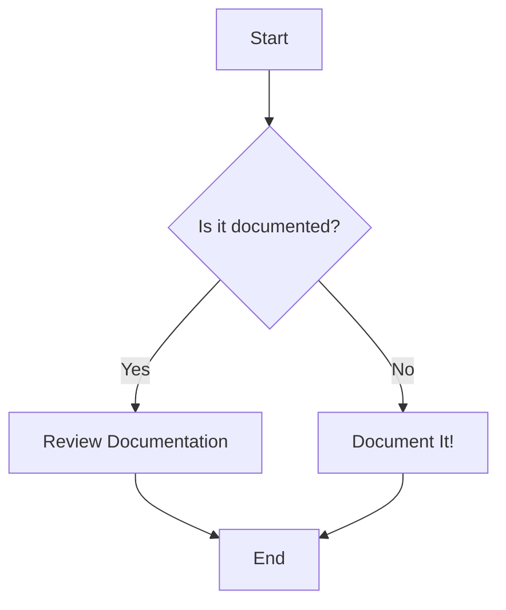

# Mermaid Diagrams

This document provides a guide on how to use Mermaid diagrams to create clear and maintainable visualizations.

## What is Mermaid?

Mermaid is a Javascript based diagramming and charting tool that renders Markdown-inspired text definitions to create and modify diagrams dynamically.

## How to use Mermaid

To use Mermaid, you need to use the `mermaid` code block in your markdown file. For example, to create a simple flowchart, you would use the following code:

This will render the following diagram:

## Resources

For more information on how to use Mermaid, you can check the following resources:

- [Mermaid Live Editor](https://mermaid.live/)
- [Mermaid Documentation](https://mermaid-js.github.io/mermaid/#/)
